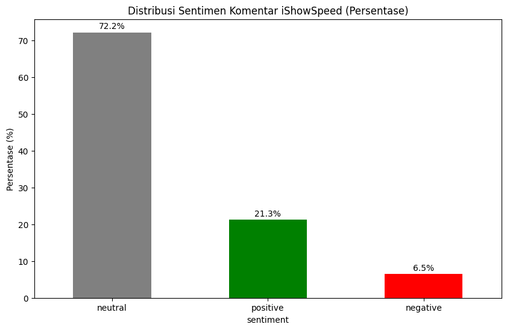
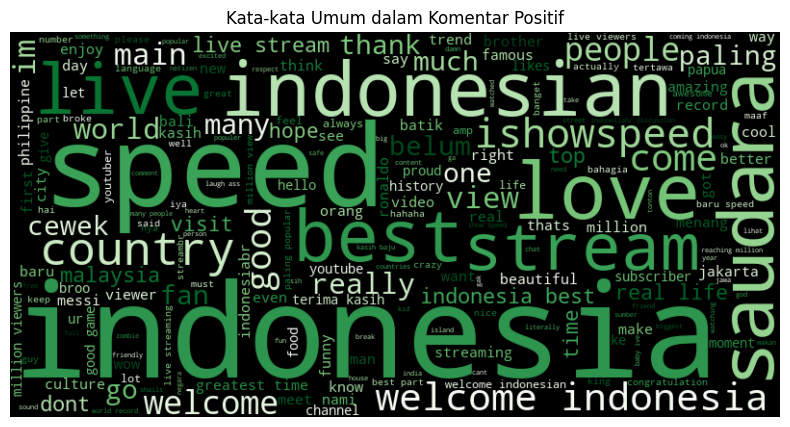
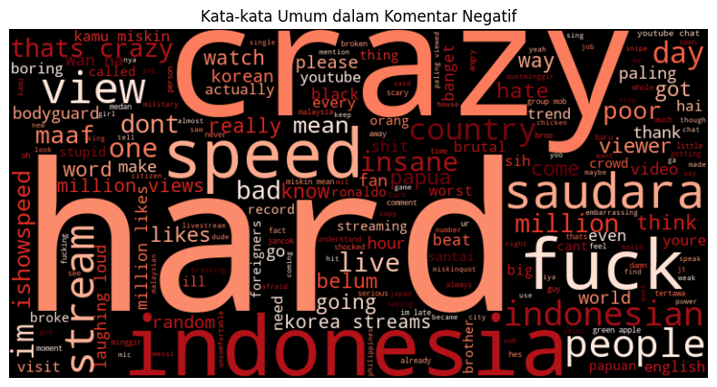
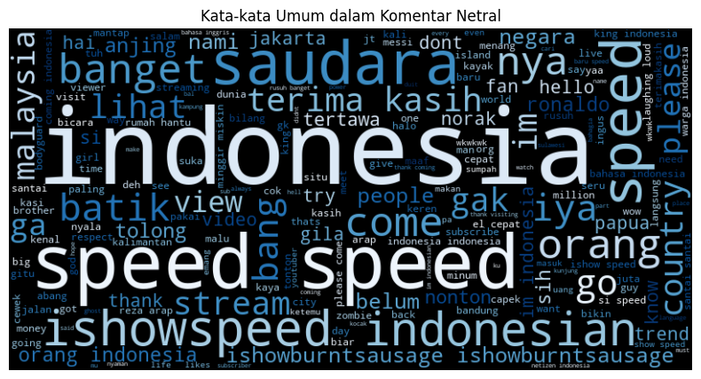

# Sentiment Analysis of YouTube Comments on iShowSpeed's Live Streaming in Indonesia 🇮🇩

<p align="center">
  
</p>
<p align="center">
  <a href="https://www.youtube.com/watch?v=9s6imDGjy08&t=329s">Click the image to watch the related YouTube video</a>
</p>

<p align="center">
  
  
  
  <a href="https://www.youtube.com/watch?v=9s6imDGjy08&t=329s">
    
  </a>
</p>

---

## 🚀 Project Overview

This project aims to analyze public sentiment regarding the arrival and live streaming of the popular content creator, **iShowSpeed**, while in Indonesia. The analysis is conducted on the comment section of one of his YouTube live streaming videos to understand the reactions and opinions of Indonesian netizens.

Using Natural Language Processing (NLP) techniques, this project classifies thousands of comments into three sentiment categories: **Positive, Negative, and Neutral**. The goal is to gain both quantitative and qualitative insights into audience responses.

---

## 📊 Key Insights & Findings

### 1. Sentiment Distribution: Dominance of Positive Responses

Overall, the community welcomed iShowSpeed very positively. Nearly three-quarters of the analyzed comments had a positive sentiment.

- 🟢 **Positive: 72.2%**
- 🔴 **Negative: 21.3%**
- ⚪ **Neutral: 6.5%**

<p align="center">
  
</p>

### 2. Sentiment-Based Word Cloud Visualization

**Positive Sentiment Word Cloud**  
Positive comments were dominated by words like **"funny", "healthy", "enthusiastic", "exciting",** and **"bro"**.

<p align="center">
  
</p>

**Negative Sentiment Word Cloud**  
Negative comments often contained words like **"rude", "toxic", "noisy"**, and other negative terms.

<p align="center">
  
</p>

**Neutral Sentiment Word Cloud**  
Neutral comments tended to be questions or neutral statements like **"bro when", "where"**, etc.

<p align="center">
  
</p>

---

## ⚙️ Project Workflow

1. **Data Collection:**

   - Using **YouTube Data API v3** to collect thousands of comments from the target video.
   - The scraping process is documented in `scraping_comment.ipynb`.

2. **Text Preprocessing:**

   - Case folding, slang/alay normalization, stopword removal, tokenization.
   - Main libraries: `NLTK`, `re`, and a custom slang dictionary.

3. **Feature Extraction:**

   - Using **TF-IDF Vectorizer** to convert text into numerical features.

4. **Modeling & Evaluation:**
   - Three models were tested: **Logistic Regression**, **Random Forest**, and **MLPClassifier**.
   - **Random Forest** achieved the best performance and was selected as the final model.

---

## 📈 Model Performance

The **Random Forest** model with the best configuration achieved the highest performance:

- **Accuracy: 92.49%**

#### Random Forest Evaluation Details:

```
             precision    recall  f1-score   support

           0       0.90      0.59      0.72        64
           1       0.92      0.98      0.95       764
           2       0.93      0.82      0.87       237

    accuracy                           0.92      1065
   macro avg       0.92      0.80      0.85      1065
weighted avg       0.92      0.92      0.92      1065
```

---

### 📊 Model Accuracy Comparison

| Model               | Accuracy      |
| ------------------- | ------------- |
| Logistic Regression | 90.70%        |
| MLPClassifier       | 89.24%        |
| **Random Forest**   | **92.49%** ✅ |

---

## 💡 Example of Model Usage (Inference)

```python
def predict_sentiment(comment):
    # Text preprocessing
    processed_text = preprocess(comment)
    # Prediction
    prediction = model.predict(vectorizer.transform([processed_text]))
    return prediction

# Example comments
comment1 = "Wow speed is so funny, I laughed so hard 😂"
comment2 = "This content makes no sense, very annoying"
comment3 = "Welcome to Indonesia Speed! We love you ❤️"

print(f"{comment1} -> Sentiment: {predict_sentiment(comment1)}")
print(f"{comment2} -> Sentiment: {predict_sentiment(comment2)}")
print(f"{comment3} -> Sentiment: {predict_sentiment(comment3)}")
```

## Example Output:

- 'Wow speed is so funny, I laughed so hard 😂' -> Sentiment: Positive
- 'This content makes no sense, very annoying' -> Sentiment: Negative
- 'Welcome to Indonesia Speed! We love you ❤️' -> Sentiment: Positive

## 🛠️ Technologies Used

This project was built using the Python ecosystem with several key libraries:

- Data Collection: google-api-python-client (For YouTube Data API v3)
- Data Analysis & Manipulation: Pandas, NumPy
- Text Preprocessing: NLTK (Natural Language Toolkit)
- Machine Learning: Scikit-learn
- Data Visualization: Matplotlib, Seaborn, WordCloud
- Work Environment: Jupyter Notebook

---

## 🧪 Try It Yourself

If you'd like to explore this project or run it on your own machine, feel free to clone the repository and follow the steps below:

### 🔧 Installation

1. **Clone the repository**

   ```bash
   git clone https://github.com/your-username/your-repo-name.git
   cd your-repo-name
   ```

2. Install dependencies

```bash
   pip install -r requirements.txt
```

3. Run the notebooks

   Open the Jupyter notebooks (e.g., sentiment_analysis.ipynb) to explore the preprocessing, training, and evaluation steps.

## 📁 Project Structure

```bash
├── assets/                 # Word cloud and visualization images
├── dataset/                # Dataset and scraped comments
├── models/                 # Saved model(s)
├── scraping_comment.ipynb  # Proces Scraping Data
├── sentiment_iShowSpeed.ipynb  # main code
├── requirements.txt        # Python dependencies
└── README.md               # Project overview

```

## ☕ Contributing & Feedback

Feel free to fork this project, give it a ⭐, or open an issue for suggestions and improvements.
Your feedback is highly appreciated!
